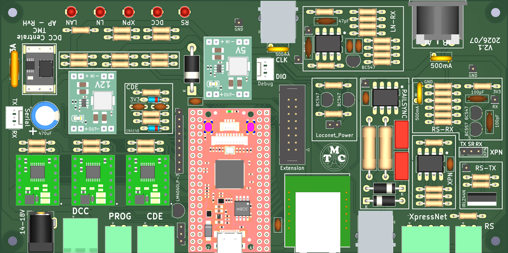
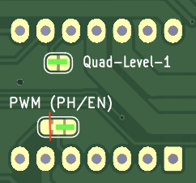
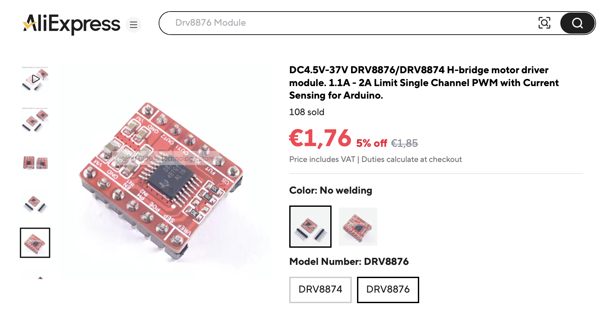
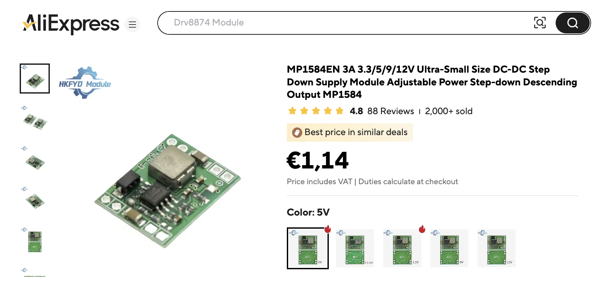
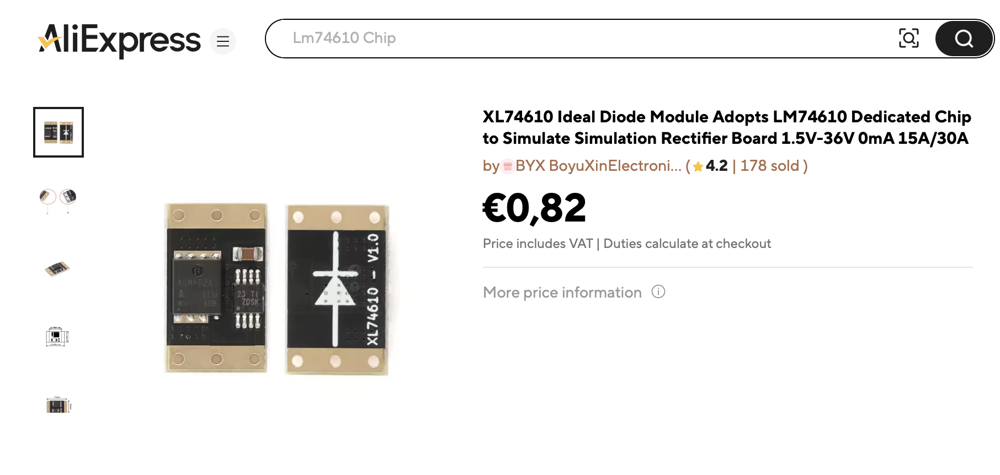
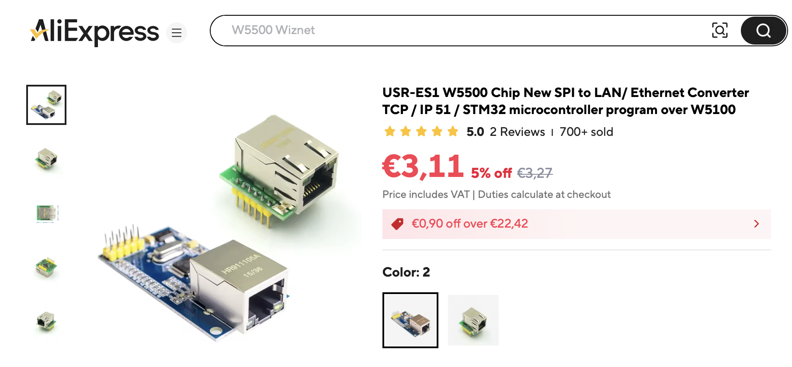
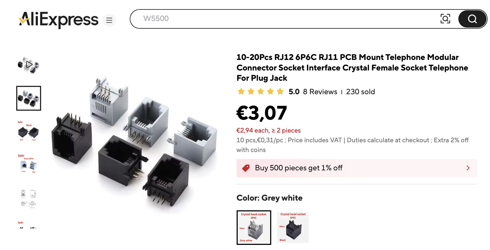
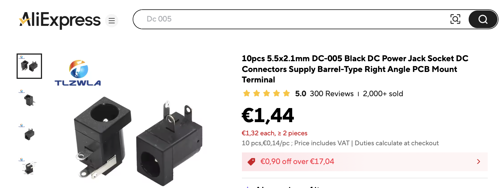
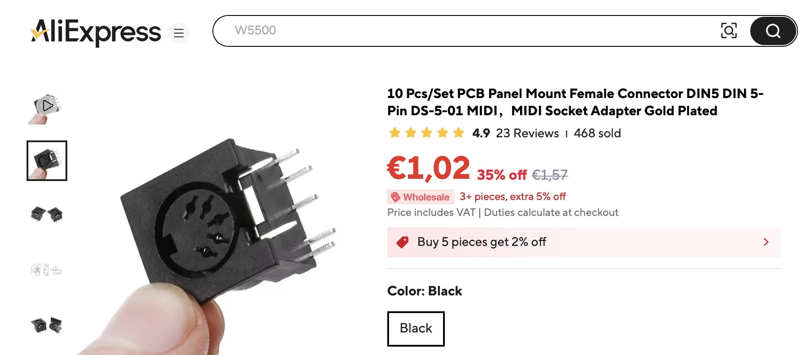

[🇬🇧 English](README.md) | [🇩🇪 Deutsch](README.de.md) | [🇳🇱 Nederlands](README.nl.md)

# DCC Command Station LZ210-TMC

Modular DCC command station with Ethernet and USB connectivity, and (partial) support for the XpressNet and Z21 protocols. The board supports LocoNet-T and XpressNet handhelds and other equipment, provides an interface for external boosters via CDE and LocoNet-B, and has a connection for RS-Bus feedback modules.

## Why this board
The [Twentse Modelspoorweg Club (TMC)](https://twentsemodelspoorweg.club) is modernising its electronics and software for digital layout control. For each of its stations (Hengelo, Enschede, Oldenzaal, Almelo) it needs its own new DCC command station to operate all turnouts and signals, and to receive occupancy feedback. Although DCC command stations are of course available ready-made, building your own is not only a nice challenge, but also a potential cost saving.

The starting point is a modular design, similar to the [Z21PG](https://pgahtow.de/w/Zentrale_Z21PG/de). Initially we looked at whether we could simply adapt or replicate this design. We quickly realised that upgrading to a modern processor and ready-made modules would lead to better results and a lower price.

The goal is to develop a command station that can be extended step by step and that **club members and other interested persons can easily adapt and rebuild**. That is why we deliberately chose an easy-to-solder, low-cost THT (Through-Hole Technology) PCB, and, for the critical components, ready-made modules that can easily be bought online.

For the processor we chose the RP2350B, mainly because of its PIO peripheral, which allows a fully jitter-free DCC signal to be generated. It is an inexpensive and modern dual-core processor, running at 125 MHz. See [processor choice](docs/processor.md) for a comparison with ESP32, DxCore and STM32.

The name LZ210-TMC was chosen as a contraction of Z21 (Roco, Z21 protocol, LocoNet) and LZ100 (Lenz, XpressNet, RS-Bus interface and CDE booster connection).

## Schematic
The complete schematic (all hierarchical sheets) is available in [Schematic.pdf](docs/Schematic.pdf).

The schematic is divided into the following functional blocks (click the name for more details):

<strong>Power supply</strong>

The command station must be powered with a DC voltage equal to the desired track voltage. In practice, a switching or laptop-style power supply can be used that can deliver a voltage between 14 and 20 volts, and 3 to 4 amps.

⚠️ **Note:** not every switching power supply is suitable or safe for this purpose. Practical advice: choose a power supply of the kind used with other DCC command stations, for example the [Roco 10851](https://www.roco.cc/rde/10851-schaltnetzteil-54-watt.html) or [YaMoRC YD7460-18](https://yamorc.de/products/?singleproduct=13843).

The external supply voltage enters via a 3 amp eFuse and a so-called "ideal diode", which protects the circuit against reverse polarity, and then feeds VCC and two step-down converter modules.

VCC powers the H-bridges for the track voltage and the programming track. VCC also runs to the processor, so that a resistor divider and an ADC input can be used to check whether the external supply voltage has the correct value.

The 12V step-down converter supplies power to LocoNet, XpressNet, the CDE booster interface, and RS-Bus feedback. The 12V voltage is likewise, for monitoring purposes, fed through a resistor divider to an ADC input.

The choice of the 5V step-down converter requires some explanation, because the processor and peripherals actually expect 3V3. The reason 5V was chosen is that the Olimex RP2350 Pico2-XL module already has its own step-down chip on board. An external 3V3 converter must *not* be connected to the 3V3 output of the Olimex module (see below). The output of the Olimex module does deliver enough power to supply the rest of the peripherals with 3V3. The diode between the 5V step-down converter and the Olimex RP2350 Pico2-XL module prevents damage from occurring if, in addition to the external supply, power is also being supplied via the USB connector.

>

>
Explanation: why not an external 3V3 on the Olimex module?

>
> The TPS62A02A chip on the Olimex module has active output discharge: as soon as the TPS62A02A is switched off (for example by pulling 3V3_EN to GND), an internal FET is switched on to actively discharge the energy still stored in the external inductor. If, in that state, 3.3V is nevertheless applied to the output of the TPS62A02A, the internal FET keeps conducting and draws tens of mA from the external supply. This can cause the SOT-563 package to overheat. This behaviour is also described on [TI's E2E forum](https://e2e.ti.com/support/power-management-group/power-management/f/power-management-forum/1305135/tps62a01-active-output-discharge).
>
> Hence the choice to feed not the 3V3 output but the VSYS input. This keeps the onboard TPS62A02A always active, regardless of whether power comes from the 5V step-down converter or from USB. The TPS62A02A can deliver enough power to also supply the remaining peripherals.
>
> This behaviour differs from the original Raspberry Pi Pico2: that board uses the RT6150B as its step-down converter, which does not have this active output discharge. On the Pico2, pulling 3V3_EN to GND and then applying an external 3.3V to the output is in fact the method documented by Raspberry Pi itself. For other RP2350B modules: always check which step-down converter is fitted first, since behaviour can differ per board.
>
> 

<strong>Processor</strong>

We chose a Raspberry Pi Pico processor; see [processor choice](docs/processor.md) for details. An important advantage of the Raspberry Pi Pico is that it has a Programmable IO (PIO) peripheral, a specialised co-processor that can generate very precisely timed output signals.

Within the Pico series there are two variants: the RP2040, with two PIOs, and the RP2350, with three PIOs. Because we use three PIOs, we chose the RP2350. The first PIO is used for the DCC signal, the second for the RS-Bus master, and the third for the XpressNet RS-485 connection.

The RP2350 in turn comes in two variants: the "plain" RP2350, which has 30 General Purpose IO (GPIO) pins, and the RP2350B, which has 18 more. For an early test version of the command station the "plain" RP2350 was used, but because we wanted to use more IO pins we ultimately chose the RP2350B.

Several suppliers (such as Olimex, Waveshare and WeAct) offer different RP2350B modules. We chose the RP2350B-X(X)L module from Olimex; see the reasoning below under Building.

>

>
Explanation: are alternative modules possible?

>
> If fewer pins and fewer PIOs are needed — for example because there is no need for an RS-Bus master or XpressNet — RP2040 modules can also be used. In that case, the PCB layout and possibly the power supply would need to be adapted.
>
> 

>

>
Explanation: why a PIO for XpressNet?

>
> On most processors it is possible to use a UART to send and receive XpressNet messages. That works because the UART on many processors supports both 8 and 9 data bits. XpressNet, however, requires 9 data bits (where the ninth bit indicates whether it is an address or a data byte). Compared with other processors, the UART on the Raspberry Pi Pico is relatively limited and only supports 8 data bits. By writing a small PIO program, it is nevertheless possible to work with 9 data bits on the Raspberry Pi Pico as well, and so support XpressNet.
>
> It would in principle be possible, with some tricks, to still use the UART on the Raspberry Pi Pico for XpressNet. However, since there are only two UARTs, we decided against this.
>
> 

<strong>Ethernet</strong>

The Ethernet schematic contains only the WIZnet W5500 module. All pins are wired through to the processor.

The older (and often more expensive) W5100 and W5100S modules will probably also work, but this has not been tested.

<strong>Track output</strong>

The DCC signal is amplified by a DRV8874 module, fitted with the same driver IC that is also used in the DCC-EX project.

The schematic contains few components because the module itself already contains a number of resistors that result in settings usable for our command station.

By default, ITRIP is set to approximately 3 amps. If desired, a different value can be chosen by removing the 2.49 kΩ resistor on the module and fitting R601 with a different value.

By default, **PMODE** is connected to 3V3, which activates PWM mode. If desired, the "PWM (PH / EN) solder jumper" on the bottom of the PCB can be used to connect **PMODE** to GND instead. To do this, remove the existing copper connection to 3V3 to avoid a short circuit, and make the other solder connection to GND.

By default, the module is set to Quad-Level 2, but this can be changed via a second "solder jumper" on the bottom of the PCB by connecting **IMODE** to GND. See the DRV8874 datasheet for the differences between the modes.

No space has been reserved on the PCB for a snubber circuit and/or power inductor. If desired, these can be placed after the connector, in the wiring to the rails.

Detailed background information on the choice and limitations of this driver IC is described on a separate page. That page discusses in detail the inrush-current problems that this and similar chips can have with capacitive loads. See: [DRV8874 output stage](docs/DRV8874.md)

<strong>Programming track</strong>

The PCB allows you to use the same DRV8874 H-bridge module as for the normal track output. The advantage of reusing modules is a uniform parts list and easier building.

However, it is better to use a DRV8876 module instead of a DRV8874 module. These modules can deliver somewhat less power, which is actually an advantage for a programming track, and they are also somewhat cheaper.

An important technical difference between the DRV8874 and DRV8876 modules is that the latter has a higher current-mirror gain factor **AIPROPI**, namely 1000 (instead of 450). As a result, the voltage seen by the processor's ADC input during a (60 mA) DCC-ACK signal is 150 mV (instead of 67 mV). This allows a more reliable measurement of the DCC-ACK signal.

As with the normal track output, it is possible to remove the 2.49 kΩ resistor fitted by default on the module and replace it with R801. A good value for R801 is 6.8 kΩ. With this value, the maximum current ITRIP that can be delivered during programming is limited to 500 mA. RCN-216 recommends a (non-mandatory) limit of 250 mA ±20% at power-up, but also permits fixed current limiters up to 1 A; 500 mA fits comfortably within that.

An additional advantage of replacing the 2.49 kΩ resistor with a 6.8 kΩ resistor is that the voltage during a DCC-ACK is increased to well over 400 mV, making it easier to measure on the processor's ADC input.

<strong>CDE booster interface</strong>

The PCB uses the same type of H-bridge module as for the programming track (DRV8876 or DRV8874). Technically, a DRV8871 module from AliExpress could also be used. However, the dimensions of this module do not fit the current PCB.

For the CDE output, the well-known inrush-current problems of the DRV887x ICs do not apply. The load is not capacitive, and the CDE signal requires no more than a few hundred milliamps. The internal short-circuit protection of the DRV887x does not trigger during start-up, unless the output is genuinely short-circuited. The DRV887x is oversized for this purpose, but can in principle be used without issue.

Detailed information about the CDE interface is described on a separate page: [CDE interface](docs/CDE.md).

<strong>LocoNet</strong>

The schematic for the LocoNet section is standard, and described in many places online. However, the values of a number of components have been adapted so that the whole works on 3V3 as well.

Besides the LocoNet-T interface, a LocoNet-B interface is also present, which supplies a RailSync signal for boosters on the outer pins of the connector. Several driver ICs can be used to generate the RailSync signal; a number of options are listed in the schematic. Of the options listed, only the UCC27425 IC has an ENABLE input, allowing the RailSync signal to be easily disabled.

33 Ω / 2 watt resistors are included on the driver outputs. On the one hand, these resistors act as short-circuit protection (which is why they need to be able to dissipate 2 watts). On the other hand, together with the 4.7 nF capacitors, these resistors form a low-pass filter, which reduces interference. The P6KE15A are ESD diodes that protect the LocoNet driver IC.

<strong>XpressNet</strong>

The XpressNet interface is simple and standard. The [OpenDCC site](https://www.opendcc.de/elektronik/opendcc/xpressnet_hw.html) has a basic circuit that many have built. The only change is that the 1K5 resistors have been replaced with 560 Ω, because the driver IC is powered not from 5V but from 3V3. The 8K2 resistor (R504) ensures the driver starts in RX mode.

A MAX(3)485 IC is often used as the driver. A better choice is the MAX(3)483, the slew-rate-limited version of this driver, since it limits possible high-frequency interference on the RS-485 line. Unfortunately, this IC is noticeably more expensive. The OpenDCC page mentioned above gives further details on possible alternative driver ICs.

<strong>RS-Bus feedback</strong>

The schematic for the RS-Bus was taken from the [Der-Moba website](https://www.der-moba.de/index.php/RS-Rückmeldebus).
The transistor for transmitting mentioned there has, however, been replaced with an (IRLZ44) MOSFET, allowing for a somewhat higher load.

## Building
To build the command station, the easiest approach is to have the current PCB manufactured by sending the file [production/TMC-Centrale.zip](production/TMC-Centrale.zip) to a company such as JLCPCB. This file contains all the (Gerber) files the manufacturer needs. In the summer of 2026, having 5 PCBs made, including shipping, cost approximately €25.

The design is open source. Building, modifying, and distributing is encouraged under the terms of the [licence](LICENSE), and with reference to this source.

The complete list of components is: [production/bom.csv](production/bom.csv).

To make building as easy as possible, we chose, wherever possible, ready-made modules of the kind sold online by AliExpress and others. Below is an overview of the main modules, as well as the connectors that fit the PCB:

<strong>RP2350B (MCU module)</strong>

For the processor we chose the [Olimex RP2350B-XL](https://www.olimex.com/Products/RaspberryPi/PICO/PICO2-XXL/open-source-hardware) module. Olimex guarantees that production of these modules will be supported until at least 2035, and has published all KiCad design files and manufacturing files openly on GitHub.

There are two variants of this module: the RP2350B-XL (€5) and the RP2350B-XXL (€9). The difference is that the XXL has some extra capabilities that are not needed for this command station. Although the schematic references the XXL, the XL variant is preferred for its price. Both variants fit the PCB, however.

The modules can be bought from [Olimex](https://www.olimex.com/Products/RaspberryPi/PICO/PICO2-XXL/open-source-hardware) directly, but also via distributors such as [TME](https://www.tme.eu).

<strong>DRV8874 / DRV8876 (motor drivers)</strong>

Ready-made DRV8874 / DRV8876 modules are used for the DCC, programming track, and CDE outputs.

Pololu brought modules for the [DRV8874](https://www.pololu.com/product/4035) and [DRV8876](https://www.pololu.com/product/4037) to market some years ago. Since spring 2026, (cheaper) variants have also become available on AliExpress. The Pololu module includes an extra reverse-polarity-protection MOSFET as additional protection, which the AliExpress modules lack. This extra protection is not needed for this command station.

<strong>Step-down module (5V/12V)</strong>

The PCB footprint dimensions are matched to the well-known MP1584 step-down modules, offered by multiple suppliers on AliExpress. Two modules are needed. The first supplies the 5V supply voltage for the processor (note: the Olimex processor module itself converts this 5V to 3V3 again), and the second module supplies 12V. Instead of modules with a fixed 5V/12V output voltage, adjustable-output modules can also be used.

Modules other than the MP1584 will in principle also work, but do not fit the PCB footprint.

<strong>Ideal-diode module</strong>

An XL74610 module is used for reverse-polarity protection, as sold on AliExpress and by other suppliers.

<strong>W5500 Ethernet</strong>

A W5500 module is used for the Ethernet connection, as sold on AliExpress and by other suppliers.

<strong>Connectors</strong>

The PCB is designed for the following connectors:

>

>
LocoNet: 6P6C (RJ12)

>
> There are several brands and types of 6P6C connectors on the market, with different footprints. The PCB is designed for connectors with a footprint matching the WayConn MJEA connectors. These have their electrical connections on the bottom (PCB side).
> 
>
> 

>

>
Barrel Jack

>
> A 5.5x2.1mm barrel jack is used for the power connector.
> 
>
> 

>

>
Terminal Blocks

>
> A PhoenixContact MSTBA 2.5/2-G, with a pin spacing of 5.00 mm, is used for the DCC track output. Terminal blocks with a pin spacing of 5.08 mm will also fit, however.
>
> A Phoenix Contact MC 1.5/2-G-3.81 terminal block is used for the programming output.
>
> A Phoenix Contact MC 1.5/3-G-3.81 terminal block is used for the CDE output.
>
> A Phoenix Contact MC 1.5/2-G-3.81 terminal block is used for the RS-Bus input.
>
> A Phoenix Contact MC 1.5/4-G-3.81 terminal block is used for the XpressNet output. A 5-pin DIN connector is fitted at the front.
>
> Variants of these connectors are offered by several manufacturers, including PTR/Hartmann.
>
> 
>
> 

## Software

The firmware for this command station can be found in its own GitHub repository, and is therefore not discussed further at: [https://github.com/tmc-digiboys/TMC-LZ210-Command-Station](https://github.com/tmc-digiboys/TMC-LZ210-Command-Station)

## Comparison with other command stations

This command station does not stand on its own, but stands in a long tradition of open-source DCC command stations:

<strong>OpenDCC</strong>

One of the earliest open-source DCC command stations is the [OpenDCC Z1](https://www.opendcc.de/elektronik/opendcc/opendcc.html). This command station was designed twenty years ago by Wolfgang Kufer.
- **Processor.** OpenDCC runs on an 8-bit Atmel AVR (ATmega32 or ATmega644P) at 16 MHz. This command station uses a dual-core RP2350 at 125 MHz with a PIO peripheral, and is therefore orders of magnitude more powerful.
- **Output stage.** OpenDCC uses a fixed H-bridge (STM L6206), theoretically rated at 2.8 A per output, but thermally limited on the PCB to about 1.5 A continuous. This command station uses a DRV8874 module (6 A theoretical), whose current is limited on the module itself to about 2.9 A.
- **Feedback.** OpenDCC supports S88, with an extension for turnout-position feedback. This command station uses RS-Bus and LocoNet.
- **Connection to a PC.** OpenDCC communicates via RS232/USB with a PC, using XpressNet or P50X as the higher-layer protocol; OpenDCC itself has no network or WiFi connection. This command station has, in addition to USB, its own Ethernet connection, and supports XpressNet and Z21 as higher-layer protocols.
- **Boosters.** OpenDCC has no separate interface for external boosters, such as CDE or LocoNet-B.
- **Handhelds.** Like this command station, OpenDCC supports XpressNet handhelds (such as the Roco Multimaus). OpenDCC does not support LocoNet handhelds, however.

The OpenDCC Z1 command station can be seen as a forerunner of open-source DCC command stations. Many of its ideas, circuits, and software have been copied (in adapted form) by others, and are still in use today. However, building the Z1 today no longer seems like a good idea: modern microcontrollers are both cheaper and many times more powerful than the 8-bit ATmega generation on which the OpenDCC Z1 was based at the time.

<strong>BiDiB</strong>

[BiDiB](https://www.bidib.org/) can be seen as a successor to the OpenDCC Z1 command station. BiDiB has been developed since 2010 by — again — Wolfgang Kufer, and is brought to market in hardware form by, among others, Fichtelbahn.
- **Architecture.** BiDiB is primarily a bus onto which multiple intelligent components (such as GBMboost/GBM16T/OpenSwitch/IF2) can be connected. It is not a command station in the traditional sense, with a built-in booster and interfaces such as XpressNet, LocoNet and RS-Bus.
- **Processor.** BiDiB implementations are based on the Atmel XMEGA processor. Although this is one of the most powerful 8/16-bit / 32 MHz processors, it is also a fairly old processor and, compared with the dual-core RP2350 / 125 MHz processor of this command station, quite expensive.
- **Building.** BiDiB PCBs are designed for SMD components. Although BiDiB designs are more advanced and of higher quality than those of this (THT) command station, they are also harder to build, adapt and extend.
- **RailCom.** BiDiB excels at receiving, analysing and processing RailCom feedback. This command station offers no support for this.

BiDiB offers a complete ecosystem with a focus on intelligent components and extensive RailCom processing. This command station is primarily a traditional command station like those from Roco and Lenz, communicating via established protocols with equipment from various manufacturers.

<strong>Z21PG</strong>

[Z21PG](https://pgahtow.de/w/Zentrale_Z21PG/) is an Arduino-based self-build project by Philipp Gahtow for a low-cost Roco Z21 clone.
- **Ease of building.** Philipp Gahtow himself publishes mainly software (Arduino sketches) and separate schematics for a number of hardware variants (Arduino MEGA, ESP32, ...). Unlike this command station, there is no official Z21PG (KiCad) PCB design. Third-party PCB designs do exist for the Z21PG, however. Both command stations are easy to build.
- **Processor and DCC signal.** The most commonly built Z21PG variant runs on an (older) ATmega2560 (16 MHz), although ESP32 is also mentioned as an option. The DCC signal is generated in software via timer interrupts, not via a dedicated hardware peripheral. This command station uses a (modern) dual-core RP2350 at 125 MHz with a PIO peripheral, more than ten times as fast and with a jitter-free DCC signal.
- **Interfaces.** Z21PG offers connections comparable to the Roco Z21 command station: LAN, X-Bus (XpressNet), L-Bus (LocoNet-T), booster connection, track and programming output. This command station additionally has an RS-Bus connection, and its booster connections are compatible with CDE and LocoNet-B.

Of all the projects discussed here, Z21PG has the most in common with this command station. Both are modularly designed and relatively easy and cheap to build. Z21PG primarily takes the Roco Z21 as its model, whereas this command station also takes the Lenz command stations as a model. Z21PG is a somewhat older design; this command station uses more modern components.

<strong>DCC-EX</strong>

A currently popular self-build command station is [DCC-EX](https://dcc-ex.com/). There are functional similarities (including the DRV8874 output stage), but also a number of significant differences:
- **Availability.** DCC-EX offers both factory-assembled boards (EX-CSB1, from approx. €75–115 excl. VAT/shipping) and DIY builds on Arduino form-factor boards. This command station is intended for self-building, and its component cost is lower (approx. €40).
- **Connection to a PC/network.** This command station uses Ethernet (XpressNet and Z21); DCC-EX uses WiFi (with JMRI, WiThrottle and Engine Driver support).
- **Interfaces for handhelds.** This command station has native (RS485) XpressNet and LocoNet interfaces, to which Lenz, Roco and other handhelds can be connected. DCC-EX focuses primarily on WiFi throttles and JMRI.
- **Interfaces for feedback.** This command station has native RS-Bus and LocoNet interfaces. DCC-EX has no such interfaces.
- **Booster interfaces.** This command station supports external boosters via LocoNet-B and the CDE interface. DCC-EX has no CDE/LocoNet-B support, but does have a RailSync mechanism, through which external boosters can be connected.
- **Mixed DCC/DC operation.** DCC-EX can switch each output between DCC and DC PWM, so that classic DC locomotives can run as well. This command station supports DCC only.

Where this command station differs most clearly is the ecosystem it fits into. DCC-EX is strongly oriented towards the American hobby scene: WiFi throttles, JMRI, and, for accessories, the LCN (Layout Control Node) concept, in which inexpensive Arduino Nanos with nRF24L01 radio modules wirelessly drive turnouts, signals and lighting. This command station, by contrast, is more oriented towards traditional European users: XpressNet and LocoNet handhelds, CDE/LocoNet-B boosters, and RS-Bus feedback. For clubs that already work with Lenz, Roco or similar equipment, that is a more direct fit than the WiFi/JMRI/LCN route taken by DCC-EX.

<strong>OpenRemise</strong>

[OpenRemise](https://github.com/OpenRemise) is explicitly aimed at **ease of use without any soldering or electronics knowledge**: the system is essentially plug-and-play and, once installed, is operated entirely via a web interface on a smartphone, tablet or PC. In that sense, its philosophy is almost the opposite of this command station.
- **Hardware.** OpenRemise is aimed mainly at users who want a ready-made PCB; the board consists mostly of SMD components and is not easy to hand-solder. This command station is aimed mainly at people who want to solder it themselves and possibly modify it.
- **Processor.** OpenRemise is based on a modern, powerful processor (ESP32), just like this command station (RP2350). For jitter-free DCC signal generation, OpenRemise uses a dedicated peripheral (RMT), just like this command station (PIO).
- **Output stage.** OpenRemise has an output stage based on discrete MOSFETs, which is superior to the DRV8874 output stage used in this command station.
- **Target audience.** OpenRemise excels at updating decoder firmware, but can also be used as a complete command station. This command station is more intended as a traditional DCC command station, and has more standard interfaces (XpressNet, LocoNet, CDE).
- **Network.** OpenRemise supports WiFi and focuses on web-based control. This command station supports Ethernet and focuses on PC control via the XpressNet / Z21 protocol.

OpenRemise is primarily a ready-made SMD PCB design with accompanying firmware. This command station is aimed primarily at hobbyists who want an inexpensive command station that is easy to build and modify. As a result, this command station has had to make a number of trade-offs (such as the DCC output stage) that OpenRemise did not have to make.

## Status and future plans
The command station has been in use at TMC since summer 2026 for operating turnouts, signals, and for occupancy feedback. Although most functions have been tested and found to work well, there is no guarantee that everything works exactly as it should.

There are plans to also create an SMD version of the command station, although these plans are not yet definite.

The PCB has room for an extension connector, carrying SPI and I2C, among others. An extension board could be used to implement additional functions, such as a display, RailCom feedback, S88N, or the CAN bus.

In principle it should also be possible to equip the command station with a WiFi interface. However, because Ethernet is more reliable, we decided against WiFi.

## References

<strong>Details of this design</strong>

- [Processor choice](docs/processor.md) — comparison of the RP2350 with ESP32, DxCore and STM32
- [DRV8874 output stage](docs/DRV8874.md) — background on the chosen driver IC and inrush-current issues
- [CDE interface](docs/CDE.md) — background on the external booster interface

<strong>Protocols and circuits</strong>

- [RailCommunity (RCN)](https://railcommunity.de) — DCC standards
- [XpressNet Specification](https://www.lenz-elektronik.de/media/0a/d1/4e/1760451943/XpressNet_V40_2.pdf?ts=1760451943) — XpressNet Version 4.0 (Lenz)
- [XpressNet circuit](https://www.opendcc.de/elektronik/opendcc/xpressnet_hw.html) — Basic circuit (OpenDCC)
- [LocoNet](https://www.digitrax.com/static/apps/cms/media/documents/tech_notes/loconet-personal-edition-1-0.pdf) — Personal Use Edition (Digitrax)
- [RS-Bus](https://www.der-moba.de/index.php/RS-Rückmeldebus) — Basic circuit (Der Moba)
- [Paco's Official Web Site](https://usuaris.tinet.cat/fmco/home_en.htm) — Basic circuits for XpressNet, LocoNet, CDE and boosters

<strong>Commercial command stations and comparable self-build projects</strong>

- [Lenz](https://www.digital-plus.de/) — LZV100/LZV200 command stations (XpressNet, CDE and RS-Bus)
- [Roco/Fleischmann](https://www.z21.eu/) — Z21 command station
- [OpenDCC](https://www.opendcc.de/)
- [BiDiB](https://www.bidib.org/)
- [Z21PG](https://pgahtow.de/w/Zentrale_Z21PG/)
- [DCC-EX](https://dcc-ex.com/)
- [OpenRemise](https://github.com/OpenRemise)

<strong>Other</strong>

- [Olimex RP2350B-XL/XXL](https://www.olimex.com/Products/RaspberryPi/PICO/PICO2-XXL/open-source-hardware) — MCU module

