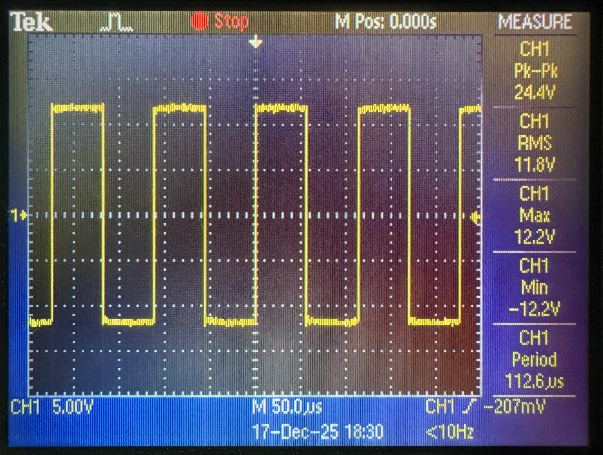
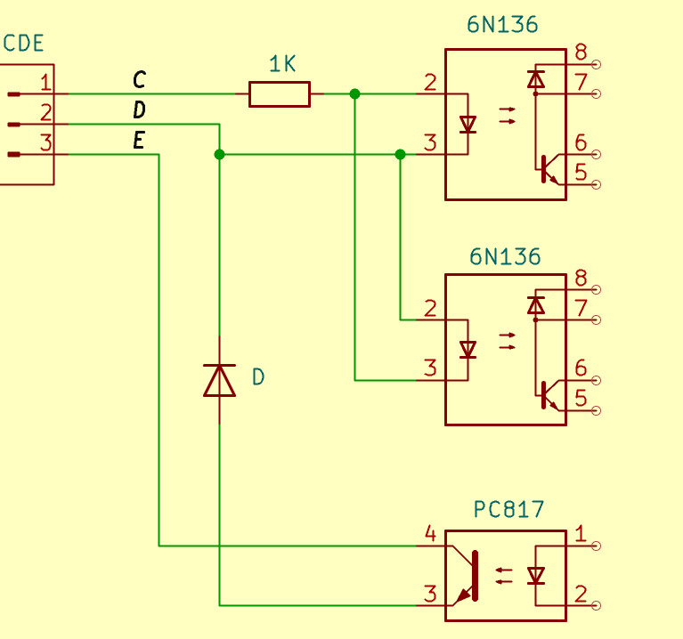
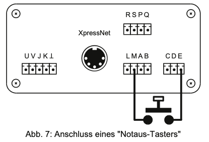
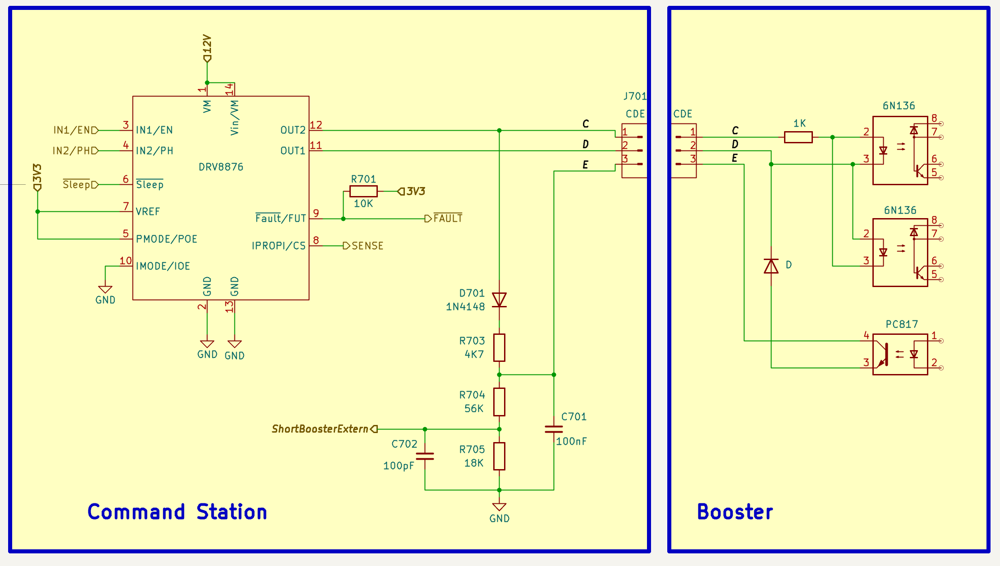

# CDE Booster Interface

Het CDE-boosterinterface is, in tegenstelling tot DCC zelf, niet vastgelegd in een RCN- of NMRA-norm. Ook Lenz, de ontwikkelaar van dit interface, heeft hierover weinig technische informatie gepubliceerd. Op internet zijn wel verschillende schema's voor de boosterkant van het interface te vinden, waaronder de [Z21PG Booster](https://pgahtow.de/w/Booster#/media/Datei:Booster_v2.png) en [Paco's BoosteR-CDE](https://usuaris.tinet.cat/fmco/railcom_en.html#booster).

De oorsprong van de naam **CDE** is niet gedocumenteerd. Op sommige internetfora wordt gesuggereerd dat de letters staan voor **C**ommon, **D**ata en **E**rror. Dat zou een mogelijke verklaring kunnen zijn, maar past niet goed bij de huidige implementatie. Bij moderne centrales zijn **C** en **D** symmetrische ten opzichte van elkaar en vormen dus een differentieel signaal. Een andere mogelijkheid is dat Lenz de letters **A** en **B** al had gebruikt voor het XpressNet-interface. De RS-485-signalen waarop XpressNet is gebaseerd, worden immers vaak aangeduid als **A** en **B**. Vanuit die gedachte zou **CDE** eenvoudigweg de volgende letterreeks kunnen zijn.

## Het CD-signaal

De aansluitingen **C** en **D** voeren het DCC-signaal waarmee de booster het railsignaal genereert. Metingen aan een **LZ100**, **LZV100** en **LZV200** laten zien dat **C** en **D** ten opzichte van massa afwisselend tussen ongeveer 0 V en +12 V schakelen. De twee aansluitingen schakelen daarbij in tegengestelde fase: wanneer **C** op 12 V staat, is **D** 0 V, en omgekeerd. Het spanningsverschil tussen **C** en **D** bedraagt daardoor afwisselend ongeveer +12 V en −12 V.

De onderstaande oscilloscoopafbeelding toont ter illustratie het **CD signaal van de LZV200**. .
Het is waarschijnlijk dat Lenz intern een H-brug gebruikt om dit CD-signaal te genereren. Zonder H-brug zou een schakeling nodig zijn die zowel +12 V als −12 V ten opzichte van massa kan genereren. Daarvoor zou een extra DC/DC-omzetter nodig zijn, waardoor de schakeling onnodig complex en dus duurder zou worden. Merk op dat de H-brug hiervoor maar weinig vermogen hoeft te leveren. Ook bij grote modelbanen met meerdere aangesloten boosters zal de benodigde stroom naar verwachting beperkt blijven tot enkele honderden milliampères.

Een legitieme vraag is of niet de DCC-spanning zelf, of een differentieel signaal van 5 V zou volstaan. Om die vraag te beantwoorden, moeten we iets beter kijken naar de ingang van de Paco-booster, zie onderstaand schema.

Het schema bevat twee optocouplers. De bovenste is actief wanneer **C** positief is ten opzichte van **D**; de onderste wanneer **C** negatief is ten opzichte van **D**. Deze constructie met twee optocouplers is nodig omdat er drie te onderscheiden toestanden zijn: **C** hoger dan **D**, **C** lager dan **D**, en de RailCom-cutout, waarbij **C** gelijk is aan **D**.

Cruciaal in deze schakeling is de weerstand van 1 kΩ die in serie staat met het **C**-signaal. Dit is meestal een weerstand met een vermogen van 250 mW. Bij een **CD** spanning van 12 V, valt ongeveer 10,4 V over deze weerstand (over de optocoupler valt een vaste voorwaartse spanning van VF = 1,6 V). De weerstand moet dan bijna 110 mW dissiperen. Bij **CD** = 16 V loopt dit op tot ruim 200 mW. Bij een spanning van 18 V of hoger wordt een 250 mW-weerstand dus overbelast.

Bij een spanning van **5 V** valt er nog maar **3,4 V** over de weerstand en bedraagt de stroom door de optocoupler-LED dus 3,4 mA. Dat is voor de LEDs in de optocoupler te weinig om bij DCC-snelheid betrouwbaar te schakelen.

## Het E-signaal

Het **E**-signaal kan door een booster worden gebruikt om kortsluiting te melden. Daartoe gebruiken zowel de Lenz- als de Paco-boosters een additionele optocoupler (zie het bovenstaande schema). Bij een kortsluiting wordt deze optocoupler ingeschakeld, waardoor stroom kan vloeien tussen **E** en **D**. Daarnaast is het mogelijk om tussen **E** en **M** (Masse = GND) een noodstopschakelaar aan te sluiten. Zie hiervoor de onderstaande afbeelding uit de handleiding van de Lenz LZV100.

### Principe Kortsluitdetectie

Onderstaand schema toont een schakeling waarmee een DCC centrale een kortsluit- of noodstopmelding kan detecteren.

Wanneer de booster een kortsluiting detecteert, activeert deze de optocoupler (bijvoorbeeld een PC817). Als de spanning op **D** hoger is dan die op **E**, spert de diode (bijvoorbeeld een 1N4148), waardoor er geen stroom kan vloeien en de spanning op **E** niet wordt beïnvloed.
Als de spanning op **D** lager is dan die op **E**, kan er wel stroom vloeien vanaf de **E**-aansluiting van de booster. Deze stroom loopt via pin 4 (collector) en pin 3 (emitter) van de optocoupler en vervolgens door de diode terug naar de **D**-aansluiting. De booster trekt **E** in dat geval dus via de optocoupler naar **D** toe.

<B>De schakeling heeft dus een *laag signaal* tijdens kortsluiting / noodstop, en een *hoog signaal* tijdens normaal bedrijf.</B>

### Normaal bedrijf
Als er geen kortsluiting wordt gemeld, werkt de schakeling als volgt. Wanneer het **C**-signaal hoog is, wordt de 100 nF-condensator (C701) via de 4,7 kΩ-weerstand (R703) opgeladen. De benodigde tijd om de condensator tot vrijwel zijn maximale spanning op te laden, hangt af van de spanning en de precieze vorm van het DCC-signaal, maar ligt in de orde van enkele milliseconden. De 1N4148-diode (D701) voorkomt dat de condensator zich ontlaadt wanneer het **C**-signaal laag is.

Om een geschikte spanning voor een 3V3-microcontrolleringang te verkrijgen, wordt de spanning over de condensator met een spanningsdeler van 56 kΩ (R704) en 18 kΩ (R705) verlaagd tot ongeveer 25% van de oorspronkelijke spanning. Bij een maximale **C** spanning van **12 V** laadt het knooppunt op tot: *Vnode = (12 − 0,7) × 18 / (56 + 18 + 4,7) ≈ 2,5 V*. De 100 pF-condensator (C702) vormt samen met de weerstands­deler een laagdoorlaatfilter met een afsnijfrequentie van ruim 100 kHz. Dit filter onderdrukt eventuele hoogfrequente storingen op de ingang van de microcontroller.

Mocht in plaats van een 3V3-microcontroller een 5V-microcontroller worden gebruikt, dan moet de weerstand van 18 kΩ worden vervangen door een weerstand van 47 kΩ.

### Kortsluiting

Tijdens een kortsluiting of noodstop kan de 100 nF-condensator via de **E**-aansluiting, de optocoupler en de diode in de booster naar **D** ontladen. Dit ontladen kan alleen plaatsvinden wanneer het **D**-signaal laag is, dus steeds maximaal 58 (DCC-1) of 100 (DCC-0) µs.

De spanning op **E** daalt daarbij tot de som van de doorlaatspanning van de diode en de verzadigingsspanning (*V*CE(sat)) van de optocoupler. Deze bedraagt typisch ongeveer 0,7 tot 1,1 V: circa 0,6 V voor de diode en 0,1 tot 0,5 V voor de optocoupler, afhankelijk van de mate waarin de fototransistor verzadigd is. Omdat de spanningsdeler de spanning over de condensator verlaagt tot ongeveer 25% van de oorspronkelijke waarde, bedraagt de spanning op de microcontrolleringang bij een kortsluiting typisch slechts 0,2 tot 0,4 V.

Bij een NOODSTOP, waarbij **E** rechtstreeks met massa wordt verbonden, wordt de spanning op de microcontrolleringang hard naar 0 V getrokken. Door de 4,7 kΩ-weerstand loopt daarbij minder dan 3 mA. Deze stroom is laag genoeg om bij 12 V niet thermisch overbelast te raken.
