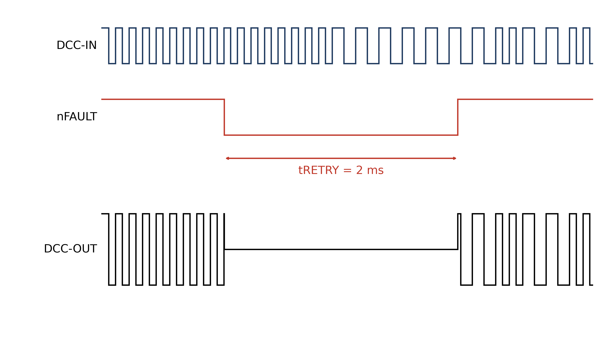
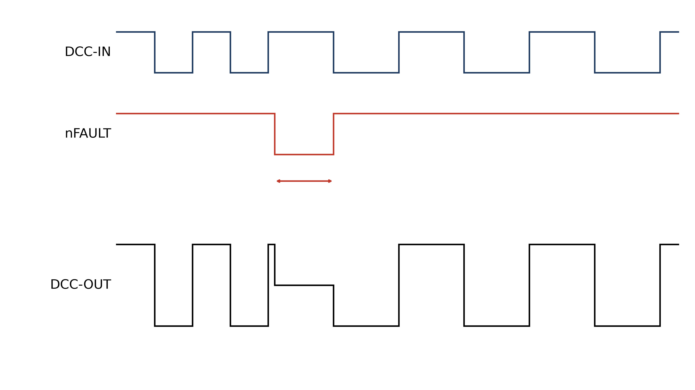
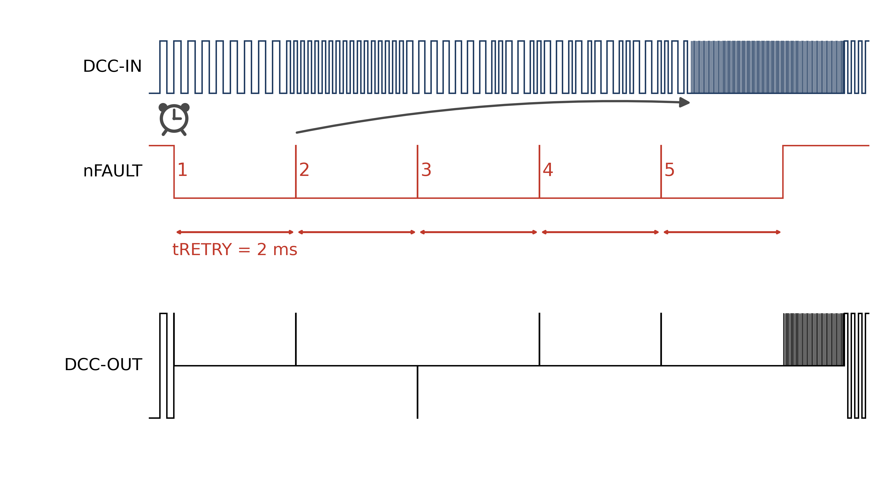
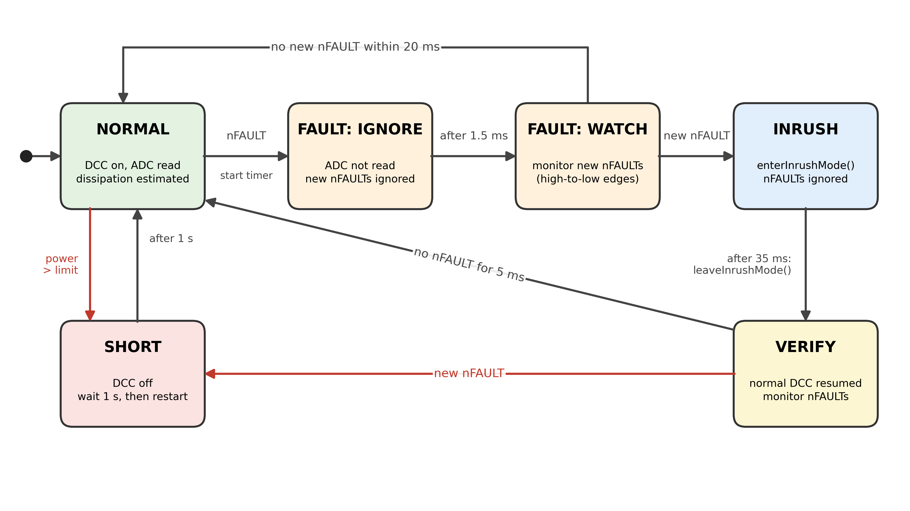

[🇬🇧 English](nFault.md) | [🇩🇪 Deutsch](nFault.de.md) | [🇳🇱 Nederlands](nFault.nl.md)

# Omgaan met nFAULTs

De DRV8874 is, net als andere moderne geïntegreerde H-brugdrivers, ontworpen voor (inductieve) motortoepassingen en kan problemen geven bij gebruik in (capacitieve) DCC-modeltreintoepassingen. De belangrijkste problemen komen voort uit de ingebouwde stroombeveiligingen, die binnen enkele microseconden reageren en daardoor te snel zijn voor modelbanen.

Er zijn twee vormen van stroombeveiliging: OCP en ITRIP.

## OCP
OCP is het ingebouwde overstroombeveiligingsmechanisme (OverCurrent Protection), dat reageert als de uitgangsstroom gedurende 3 µs of langer meer dan 6 (minimaal) tot 10 (typisch) ampère bedraagt. Als de DRV8874 is ingesteld op Quad-Level 2 (zoals bij de LZ210-TMC centrale), trekt OCP nFAULT laag en schakelt het DCC-uitgangssignaal gedurende 2 ms uit. Na 2 ms verschijnt het DCC-signaal weer, zoals te zien in de onderstaande figuur.

Als de oorzaak van de OCP-fout niet is verdwenen, dan wordt nFAULT na 2 ms opnieuw actief zodra de uitgang weer wordt ingeschakeld. Dit is in onderstaande figuur te zien.

## ITRIP
ITRIP is het ingebouwde stroomregelmechanisme. Het vergelijkt de spanning over de sense-weerstand (IPROPI) met VREF. Als de uitgangsstroom langer dan enkele microseconden boven ITRIP komt, wordt het DCC-uitgangssignaal uitgeschakeld. In Quad-Level 2 (= Cycle-By-Cycle) trekt de DRV8874 het nFAULT signaal laag tot de eerstvolgende transitie van het ingangssignaal. Bij die transitie wordt nFAULT vrijgegeven en volgt de uitgang het ingangssignaal weer, zoals in de onderstaande figuur te zien is.

In tegenstelling tot OCP schakelt ITRIP de uitgang niet gedurende een vaste tijd uit, maar voor de rest van de huidige halve bit: maximaal 58 µs bij een 1-bit en 100 µs bij een 0-bit. Toch wordt ook in dit geval het DCC-uitgangssignaal verstoord.

Blijft de oorzaak van de ITRIP-fout bestaan, dan wordt nFAULT opnieuw actief zodra de uitgang weer wordt ingeschakeld, na elke transitie van het ingangssignaal, dus elke 58 of 100 µs. Zie onderstaande figuur.

## Waardoor overstroom?
Op een DCC-modelbaan zijn er meerdere oorzaken voor overstroom:
1. De belasting vraagt meer stroom dan de DRV8874 kan leveren. Dit kan komen doordat de locomotieven en rijtuigen te veel stroom opnemen. Een mogelijke oplossing is de waarde van de sense-weerstand (IPROPI) te verlagen, waardoor de ITRIP-drempel stijgt.
2. De baanspanning is zojuist ingeschakeld. Condensatoren in locomotieven en rijtuigen kunnen aanvankelijk een hoge inschakelstroom (inrush) vragen terwijl ze worden opgeladen. Dit kan de stroombeveiliging tijdelijk activeren. Zodra de condensatoren zijn opgeladen, daalt de stroom normaal gesproken weer tot zijn normale waarde.
3. Er is een kortsluiting op de baan. In dat geval blijft de overstroom bestaan tot de kortsluiting is opgeheven. Het is belangrijk onderscheid te maken tussen permanente kortsluitingen, zoals een ontspoorde locomotief, en tijdelijke microkortsluitingen, zoals kortstondig contact op wissels tussen wielflenzen op het hartstuk.

Afhankelijk van de oorzaak zijn verschillende oplossingen mogelijk. In geval 1 kan de hardware worden aangepast, bijvoorbeeld door de ITRIP-drempel te verhogen. In geval 2 kunnen softwaremaatregelen zoals een speciaal inrush-signaal bij het inschakelen helpen. In geval 3 verdwijnen microkortsluitingen vanzelf, maar een echte kortsluiting moet altijd worden gedetecteerd en verwijderd. In de praktijk heeft de DRV8874 vaak te maken met een combinatie van oorzaak 1 (hoge gemiddelde belasting) en oorzaak 2 (korte inrush-belasting), wat het lastig maakt het probleem op te lossen.

## Onderscheid tussen OCP- en ITRIP-fouten

Voordat maatregelen worden gekozen, kan het belangrijk zijn vast te stellen of de fout door OCP of ITRIP is veroorzaakt. Dat kan door het interval tussen opeenvolgende nFAULT-gebeurtenissen te meten: wanneer de processor de eerste nFAULT detecteert, start hij een timer en gaat hij naar een speciale toestand.
1. Binnen de eerstvolgende 2 ms treden meerdere nieuwe nFAULT-gebeurtenissen op. **De fout is door ITRIP veroorzaakt**. Het exacte aantal gebeurtenissen kan via de webinterface worden gerapporteerd.
2. De eerstvolgende nFAULT-gebeurtenis treedt na ongeveer 2 ms op. **De fout is door OCP veroorzaakt**. De software moet vermoedelijk een bereik van 1,5 tot 3 ms hanteren om rekening te houden met variaties in de timing.
3. Binnen de eerstvolgende milliseconden treedt geen nieuwe nFAULT-gebeurtenis op. Het probleem kan door microkortsluitingen zijn veroorzaakt. Er is geen specifieke actie nodig en statistieken over deze gebeurtenissen kunnen via de webinterface worden gerapporteerd.

## Maatregelen bij OCP-fouten

Bij een OCP-fout is het belangrijk onderscheid te maken tussen een inrush-probleem en een echte kortsluiting op de baan. Een mogelijke aanpak is een speciaal inrush-signaal te sturen, bestaande uit een korte AAN-puls van 2,5 µs, die korter is dan de 3 µs die nodig is om OCP te activeren, gevolgd door 17,5 µs UIT. Hierdoor kunnen condensatoren worden opgeladen terwijl wordt voorkomen dat OCP na 2 ms opnieuw een nFAULT veroorzaakt.

Dit is weergegeven in de onderstaande figuur. Nadat de processor de eerste nFAULT detecteert, start hij een timer. Detecteert de processor na ongeveer 2 ms een tweede nFAULT-gebeurtenis, dan gaat hij naar de inrush-modus.

Zoals in de bovenstaande figuur te zien is, verschijnt het inrush-patroon niet direct, maar pas nadat het huidige DCC-pakket is voltooid. Omdat de lengte van een DCC-pakket (ruwweg) tussen 6 en 13 ms kan liggen, is het mogelijk dat er nog meerdere nFAULTs optreden voordat het inrush-patroon op de uitgang verschijnt.

Zodra het inrush-patroon verschijnt, worden de condensatoren opgeladen. Voor een condensator van 1000 µF kan de benodigde oplaadtijd 10 tot 20 ms bedragen. Het inrush-patroon moet daarom minimaal 20 ms op de baan aanwezig zijn voordat het effect heeft. Daarna kan het normale DCC-bedrijf worden hervat. Als direct nieuwe nFAULTs optreden, is er waarschijnlijk een echte kortsluiting en moet het DCC-signaal worden uitgeschakeld (zie de Aanbeveling aan het einde).

Het is echter belangrijk dat het inrush-patroon niet te lang duurt. Omdat de pulsen korter zijn dan de OCP-deglitchtijd, spreekt OCP nooit aan, waardoor het risico bestaat dat de DRV8874 oververhit raakt. Omdat de pulsen zeer kort zijn, kan de warmte zich mogelijk niet snel genoeg verspreiden om de interne thermische uitschakeling (TSD) te activeren, waardoor de chip kan worden beschadigd.

Daarom zou de software de spanning over de sense-weerstand (IPROPI) kunnen meten, om te bepalen of de stroom hoog blijft of langzaam afneemt. Blijft de stroom hoog, dan is er waarschijnlijk een kortsluiting op de baan en moet de processor het uitgangssignaal uitschakelen. Neemt de stroom af, dan is OCP waarschijnlijk geactiveerd door een inrush-stroom van condensatoren, en kan de processor langer in de inrush-modus blijven.

Het meten van de spanning over de sense-weerstand is niet triviaal. De pulsen zijn zeer kort en de vorm van het signaal op de ADC-ingang hangt af of de in het DRV8874-datasheet voorgestelde condensator van 10 nF is geplaatst. De onderstaande figuur illustreert dit voor stroompieken van 10 A (geïdealiseerd: de interne IPROPI-klem begrenst de werkelijke spanning). Zonder de condensator zijn de pieken hoog maar duren ze korter dan 1 µs. De ADC zou ze alleen in free-running mode kunnen meten, en niet elke puls heeft dan een zinvolle waarde: bij 20 samples op 500 kS/s (40 µs) moet de processor de hoogst gemeten waarde kiezen. Met de 10nF condensator bedraagt de maximale spanning echter slechts 0,4 V, met een afname met een tijdconstante van ongeveer 13 µs.

In de praktijk is er vaak sprake van een combinatie van een hoge permanente belasting en een korte capacitieve inschakelstroom. Als bijvoorbeeld de permanente belasting al 2 A bedraagt en een nieuwe locomotief met een condensator van 1000 µF op de baan wordt gezet, kan OCP worden geactiveerd. Het activeren van het inrush-patroon is dan mogelijk niet voldoende om de condensator op te laden en gelijktijdig 2 A te blijven leveren. Het gevolg is dat het systeem zich dan gedraagt alsof er een kortsluiting op de baan is.

## Maatregelen bij ITRIP-fouten

Ook als nFAULT door ITRIP wordt geactiveerd, kan er sprake zijn van een combinatie van oorzaken.
Een mogelijke oorzaak is dat condensatoren in locomotieven een hoge inrush-stroom veroorzaken, maar de weerstand van bedrading en rails die stroom beperkt tot onder het OCP-niveau. Zoals in de bovenstaande ITRIP-figuren te zien is, wordt het DCC-uitgangssignaal na ongeveer 3 µs uitgeschakeld, elke 58 of 100 µs. Als er geen andere significante belasting op de baan aanwezig is, kan een condensator van 1000 µF dan na enkele tientallen ms zijn opgeladen. In dat geval verdwijnen de nFAULTs vanzelf. Op een echte modelbaan is echter de combinatie van capacitieve en weerstandsbelasting waarschijnlijker, wat tot vergelijkbare problemen leidt als hierboven besproken, en waardoor de nFAULTs mogelijk nooit verdwijnen.

Bij ITRIP-fouten kan het genereren van een speciaal inrush-signaal enig nut hebben. Zonder het inrush-patroon bedraagt de duty cycle ongeveer 2 % tot 4 %, afhankelijk van of een 1-bit (58 µs) of een 0-bit (100 µs) wordt verzonden. Met het inrush-patroon neemt de duty cycle toe tot 12,5 %, zodat condensatoren sneller worden opgeladen. Zodra de nFAULTs verdwijnen, moet de processor de inrush-modus verlaten en terugkeren naar normaal DCC-bedrijf. Verdwijnen de nFAULTs niet, dan is er geen softwareoplossing mogelijk. In dat geval moet een melding op de webinterface verschijnen en het DCC-signaal worden uitgeschakeld.

Permanente ITRIP-fouten kunnen enkel worden opgelost door de hardware aan te passen. Er zijn drie mogelijkheden:
1. VREF verhogen. Dit is in de praktijk meestal onmogelijk, omdat VREF vaak al is aangepast aan de maximale spanning die de ADC aankan (op het LZ210-TMC-board is VREF 3 V).
2. De sense-weerstand (IPROPI) verlagen, en daarmee de maximale stroom verhogen voordat ITRIP aanspreekt. De Pololu- en AliExpress-modules hebben een sense-weerstand van 2,49 kΩ, wat bij een VREF van 3 V een ITRIP-waarde geeft van bijna 2,7 A. Deze waarde is vrij laag, maar verklaarbaar, want deze modules kunnen ook met een VREF van 5 V worden gebruikt, en leveren dan 4,4 A. Als de CPU toch al het gemiddelde stroomverbruik bewaakt en ingrijpt als de gemiddelde dissipatie boven de 2,5 à 3 W komt, is het verstandig om de ITRIP-waarde te verhogen tot ongeveer 6 A. Met een VREF van 3 V, kan de sense-weerstand vervangen worden door een 1 kΩ weerstand, of een extra 1,8 kΩ weerstand worden geplaatst parallel aan de 2,49 kΩ sense-weerstand op de module.
3. Een condensator parallel aan de sense-weerstand (IPROPI) plaatsen. Het datasheet stelt een condensator van 10 nF voor, om kortstondige pieken te filteren zodat de stroomregeling niet voortijdig aanspreekt. Als bijeffect vertraagt dit ITRIP en wordt de spanning gladder, waardoor de ADC-waarde makkelijker te lezen is.

Ter illustratie toont de onderstaande figuur (VREF = 3 V, R_sense = 1,35 kΩ, ITRIP = 4,9 A) het effect van de condensator van 10 nF bij een gemiddelde stroom van 3 A en 5 A. Zoals aan de rechterkant van de figuur te zien is (het geval van 5 A, dus overbelasting), spreekt ITRIP zonder de condensator van 10 nF al na enkele µs aan, terwijl dit met de condensator van 10 nF veel later gebeurt. Het meten van de spanning over de sense-weerstand door de ADC is zonder condensator vrij lastig, maar met condensator goed mogelijk, mits de ADC in free-running mode draait en de hoogste waarden selecteert.

## Aanbeveling

De beste aanpak is ITRIP-gerelateerde nFAULTs zoveel mogelijk te voorkomen. Op het LZ210-TMC-board kan dit door de sense-weerstand (IPROPI) op 1 kΩ te zetten, of door een extra weerstand van 1,8 kΩ parallel te plaatsen aan de 2,49 kΩ sense-weerstand op de module. In beide gevallen komt de ITRIP-waarde boven 6 A. De condensator van 10 nF mag worden geplaatst, maar is niet essentieel. De ADC kan dan de stroom betrouwbaar meten tot ongeveer 5 à 6 A, en de software moet vervolgens de dissipatie in de DRV8874 inschatten (I² × RDS(on), gemiddeld over de tijd om de thermische traagheid van de chip te modelleren) en het DCC-signaal op tijd uitschakelen om oververhitting te voorkomen.

Als er een nFAULT optreedt, ongeacht of deze door OCP of ITRIP is veroorzaakt, gaat de processor naar een foutstatus en wordt de ADC niet meer gelezen. Gedurende de eerste 1,5 ms worden nieuwe nFAULTs genegeerd, omdat deze door een microkortsluiting kunnen zijn veroorzaakt. Vanaf 1,5 ms bewaakt de processor nFAULT weer (let op: het nFAULT-niveau kan nog laag zijn van de eerste nFAULT). Als de nFAULT door OCP is veroorzaakt, wordt de volgende nFAULT 500 µs nadat de monitoring is hervat verwacht (omdat de herstarttijd 2 ms is); als de nFAULT door ITRIP is veroorzaakt, wordt de volgende nFAULT binnen enkele honderden µs verwacht. Treedt er gedurende de daaropvolgende 20 ms (instelbaar) geen nieuwe nFAULT op, dan was de oorzaak een microkortsluiting en keert de processor terug naar normaal bedrijf. Treden er een of meer nieuwe nFAULTs op, dan wordt de inrush-modus gedurende 35 ms ingeschakeld (instelbaar tot 100 ms). Omdat het inrush-patroon pas op de baan verschijnt nadat het huidige DCC-pakket is voltooid (wat ongeveer 13 ms kan duren), is het patroon minimaal 20 ms op de baan aanwezig. Eventuele extra nFAULTs die gedurende deze periode optreden, worden genegeerd.

Nadat het inrush-patroon is beëindigd, worden weer normale DCC-pakketten verstuurd. De processor blijft nFAULTs gedurende 5 ms monitoren (instelbaar, maar minimaal het OCP-herstartinterval van 2 ms). Treden er geen nFAULTs meer op, dan keert de processor terug naar normaal DCC-bedrijf. Treden er wel nieuwe nFAULTs op, dan is er waarschijnlijk sprake van kortsluiting: het DCC-signaal moet dan worden uitgeschakeld en bijvoorbeeld na 1 s (instelbaar) moet het opnieuw worden geprobeerd.

