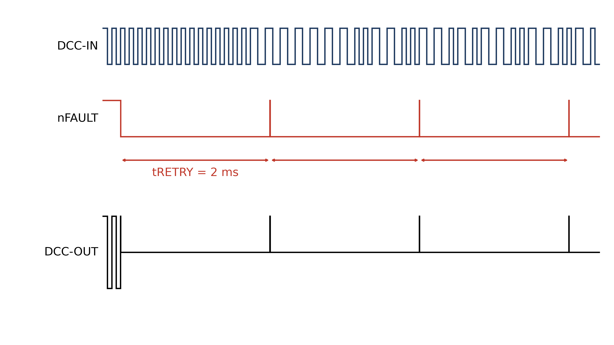
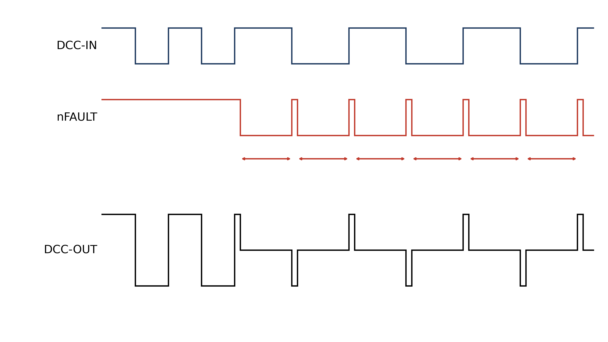
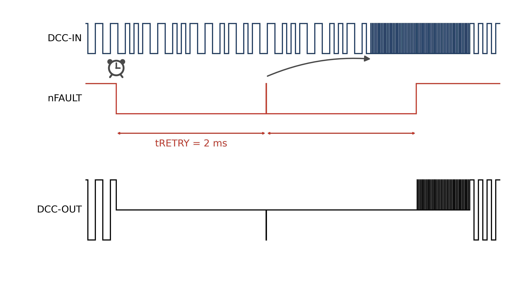
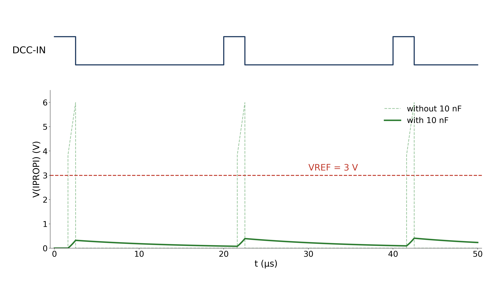
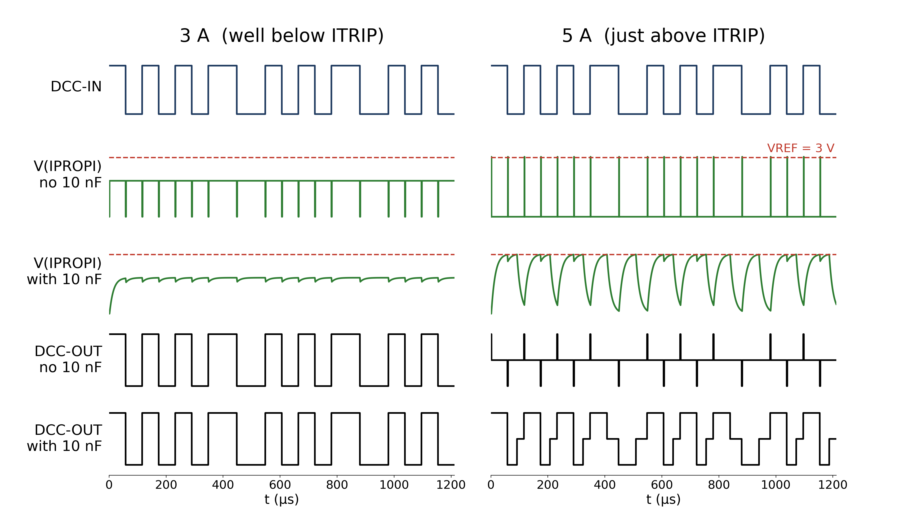

# Dealing with nFAULTs

The DRV8874, like other modern integrated H-bridge drivers, is designed for (inductive) motor applications and can be problematic when used in (capacitive) DCC model train applications. The main problems stem from the built-in current protection mechanisms, which react within a few microseconds and are thus too fast for model trains.

There are two forms of current protection: OCP and ITRIP.

## OCP
OCP is the built-in Overcurrent Protection mechanism, which reacts if the output current exceeds 6 (minimum) to 10 (typical) amperes for a period of 3 µs or longer. If the DRV8874 is configured in Quad-Level 2 (= Automatic Retry; the case for the LZ210-TMC), OCP pulls down nFAULT and disables the DCC output signal for a period of 2 ms. After 2 ms the DCC reappears, as shown in the figure below.

If the cause of the OCP fault remains, nFAULT is asserted again when the output power is restored after 2 ms, as shown in the figure below.

## ITRIP
ITRIP is the built-in current regulation mechanism. It compares the voltage across the sense (IPROPI) resistor with VREF. If the output current exceeds ITRIP for longer than a few microseconds, the DCC output signal is switched off. In Quad-Level 2 (= Cycle-By-Cycle) the DRV8874 pulls down nFAULT, until the next transition of the input signal. At that transition nFAULT is released and the output follows the input again, as shown in the figure below.

Unlike OCP, ITRIP does not switch the output off for a fixed time, but for the remainder of the current half-bit: at most 58 µs for a 1-bit and 100 µs for a 0-bit. Nevertheless, also in this case the DCC output signal is corrupted.

If the cause of the ITRIP fault remains, nFAULT is asserted again when the output power is restored after each transition of the input signal, thus every 58 or 100 µs. This is shown in the figure below.

## Why overcurrent?
On a DCC model railway layout, there are several possible causes of an overcurrent condition:
1. The load requires more current than the DRV8874 can deliver. This may be caused by the locomotives and coaches drawing too much current. A possible remedy is to lower the value of the sense (IPROPI) resistor, thereby increasing the ITRIP threshold.
2. The track power has just been switched on. Capacitors in locomotives and coaches can initially draw a high inrush current while they are being charged. This may temporarily trigger the current protection. Once the capacitors are charged, the current normally drops to its normal level.
3. There is a short circuit on the track. In this case, the overcurrent condition remains until the short circuit is removed. It is important to distinguish between permanent short circuits, such as a derailed locomotive, and temporary micro-short circuits, such as brief contact between wheel flanges and the opposite rail on turnouts.

Depending on the cause, different remedies are possible. In case 1, the hardware can be adapted, for example by increasing the ITRIP threshold. In case 2, software measures such as a special inrush signal during power-up may help. In case 3, micro short circuits will automatically disappear, but a real short circuit must always be detected and removed. In practice the DRV8874 may often encounter a combination of condition 1 (high average load) and condition 2 (short inrush load), which makes it more difficult to resolve the problem.

## Distinguishing between OCP and ITRIP faults

Before deciding on possible measures, it is important to determine whether the fault is caused by OCP or ITRIP. This can be determined by measuring the interval between successive nFAULT events: when the processor detects the first nFAULT event, it starts a timer and enters a special state.
1. Several new nFAULT events occur within the next 2 ms. **The fault was triggered by ITRIP**. The exact number of events can be reported via the web interface.
2. The next nFAULT event occurs after roughly 2 ms. **The fault was triggered by OCP**. The software should presumably use a range between 1.5 and 3 ms to account for timing variations.
3. No new nFAULT event occurs within the next few milliseconds. The problem may have been caused by micro-short circuits. No specific actions are needed and statistics on these events can be reported via the web interface.

## Measures for OCP faults

In case of an OCP fault, it is important to distinguish between an inrush problem and a short circuit on the track. A possible approach is to send a special inrush signal consisting of a short 2.5 µs ON pulse, which is shorter than the 3 µs required to trigger OCP, followed by 17.5 µs OFF. This allows capacitors to charge while preventing OCP from triggering another nFAULT after 2ms.  

This is shown in the figure below. After the processor detects the first nFault, it starts a timer. If the processor detects a second nFAULT event after roughly 2 ms, it enters inrush mode.  

As can be seen from the figure above, the inrush pattern does not appear immediately, but only after the current DCC packet is complete. Since the length of a DCC packet may be anything between (roughly) 6 and 12 ms, it is possible to still see multiple nFAULTs before the inrush pattern appears on the output.

Once the inrush pattern appears, capacitors will get charged. For a 1000 µF capacitor, the required charging time may be 10 to 20 ms. Inrush mode should therefore last at least that time before it has any effects. A viable approach is therefore to enter inrush mode for 10 to 20 ms, and presume normal DCC operation immediately after. If new nFAULTs appear, the approach may be repeated a couple of times.

However, it is important that the inrush pattern does not take too long. In fact the pulses are shorter than the OCP deglitch time, so OCP never trips, which runs the risk of overheating the DRV8874. Since pulses are very short, the heat may not spread quickly enough to trigger the internal Thermal shutdown (TSD) protection, and thereby destroying the chip.

Therefore the software could monitor the voltage over the sense (IPROPI) resistor, to check if the current remains high, or slowly decreases. If it remains high, there is likely a short circuit on the track and the processor should remove the output signal. If the current decreases, the OCP is likely triggered by capacitor inrush current, and the processor may stay in the inrush mode for a longer period.

Measuring the voltage across the sense resistor is not trivial. The pulses are very short, and the shape of the signal at the ADC input depends on whether the 10 nF capacitor suggested in the DRV8874 datasheet is fitted. The figure below illustrates this for 10 A current peaks (idealized: the internal IPROPI clamp limits the real voltage). Without the capacitor the peaks are high but last less than 1 µs. The ADC can only catch them in free-running mode, and not every pulse will be caught: with 20 samples at 500 kS/s (40 µs) the processor should select the highest measured value. With the capacitor the maximum voltage is only about 0.4 V, decaying with a time constant of about 13 µs.

In practice there may be a combination of high permanent load and a short capacitive inrush. If, for example, the permanent load is 2 A and a new engine with a 1000 µF capacitor is placed on the tracks, the OCP may get triggered. In that case activating the inrush pattern may not be sufficient to charge the capacitor, and still deliver 2 A. As a result, the system behaves as if there is a short circuit on the track.

## Measures for ITRIP faults

Also if nFAULT is triggered by ITRIP, there may be a combination of causes.
One possible cause is that capacitors within engines are responsible for a high inrush current, but the resistance of wires and tracks limit that current below the OCP level. As can be seen in the ITRIP figures above, the DCC output will be disabled after roughly 3 µs every every 58 or 100 µs. Provided that no other significant load exists on the tracks, a 1000 µF capacitor may get loaded after some tens of ms. In that case the nFAULTs will automatically disappear. However, on a real layout, a combination of capacitive and resistive load is more likely, which results in similar problems as discussed above, meaning that the nFaults may never disappear.

In case of ITRIP faults the generation of a dedicated inrush signal may be of some use. Without the inrush pattern, the duty cycle is around 2% to 4%, depending on whether a 1-bit (58 µs) or a 0-bit (100 µs) is being sent. With inrush pattern, the duty cycle increases to 12,5%, thus capacitors will be charged faster. As soon as the nFaults disappear, the processor should leave the inrush mode, and switch back to normal DCC mode. If the nFaults do not disappear, no software solution is possible. This case should be written to the web interface, and the DCC signal should be removed.

Permanent ITRIP faults may only be resolved by modifying the hardware. Three options exist:
1. Increasing VREF. This is rather a theoretical option, since in practice VREF may already be close to its maximum value (3V on the LZ210-TMC board).
2. Lower the sense (IPROPI) resistor, and thereby increase the maximum current before ITRIP triggers. On Pololu / AliExpress modules the sense resistor is 2,49 kΩ, resulting in an ITRIP value of nearly 3 A. This value is relatively conservative, to avoid possible Thermal shutdown (TSD) protection. However, if the CPU keeps monitoring the average current usage, and ensures that the average dissipation stays between 2,5 and 3 Watt, it will be better to increase the ITRIP  value to around 6 A by replacing the sense resistor to 1 kΩ, or put a 1,8 kΩ parallel to the onboard's 2,49 kΩ sense (IPROPI) resistor.
3. Put a capacitor over the sense (IPROPI) resistor. The datasheet proposes a 10 nF capacitor, to avoid spikes and make reading of the ADC value above ITRIP more reliable.

To illustrate this, the figure below shows (VREF = 3V, Rsense = 1,35 kΩ, ITRIP = 4,9 A) the effect of the 10 nF capacitor for a 3 ampère and 5 ampère average current. As can be seen at the right side of the figure (the 5A case, thus overload), without the 10 nF capacitor ITRIP triggers already after a few µs, whereas with 10 nF capacitor ITRIP triggers much later.  Using the ADC to measure the voltage over the sense resistor without capacitor will be quite difficult, but with capacitor doable, provided the ADC runs in free-running mode, and catch the highest values.

## Recommendation

The best approach is to prevent ITRIP related nFAULTS as much as possible. This can be done by setting the sense (IPROPI) resistor to 1 kΩ, thus an ITRIP value above 6 A. The 10 nF capacitor may be fitted, but is not essential. The ADC can then measure the current reliably up to roughly 5 to 6 A, and the software can estimate the dissipation in the DRV8874 (I² × RDS(on), low-pass filtered) and switch off the DCC signal in time to prevent overheating.

If an nFAULT occurs, regardless of whether it is caused by OCP or ITRIP, the processor enters a fault state and the ADC is no longer read. During the first 1.5 ms new nFAULTs are ignored, since they may be caused by a micro short circuit. From 1.5 ms onwards the processor monitors nFAULT again (note that the nFAULT level may still be low from the first nFAULT). In case the nFAULT was caused by OCP, the next nFAULT is expected 500 µs after nFAULT monitoring is resumed (since the retry time is 2 ms); in case the nFAULT was caused by ITRIP, the next nFAULT is expected within a few hundred µs. If no new nFAULT occurs during the following 20 ms (configurable), the cause was a micro short circuit, and the processor returns to normal operation. If one or more new nFAULTs occur, inrush mode is enabled for 35 ms (configurable up to 100 ms). Since the inrush pattern only appears on the tracks after the current DCC packet has been completed (which can take roughly 13 ms), the pattern remains present on the tracks for at least 20 ms. Any additional nFAULTs occurring during this period are ignored.

After the inrush pattern is sent, the sending of normal DCC packets is resumed. The processor keeps monitoring nFAULTs for 5 ms (at least the OCP retry interval). If no nFAULT occurs, the processor returns to normal DCC operation. If new nFAULTs occur, there is likely a short circuit: the DCC signal is switched off and retried after, for example, 1 s (configurable).

